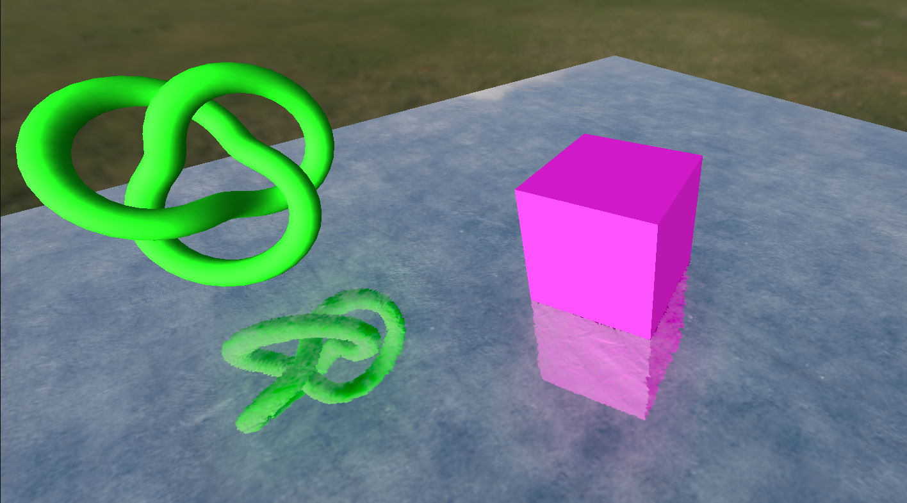

# Vanilla three.js MeshReflectorMaterial example


<br>
<br>

All credits for the original MeshReflectorMaterial implementation go to:
[pmndrs/drei](https://github.com/pmndrs/drei)

## Installation
```
git clone https://github.com/0beqz/vanilla-threejs-meshreflectormaterial-example
cd vanilla-threejs-meshreflectormaterial-example
npm i
npm run dev
```